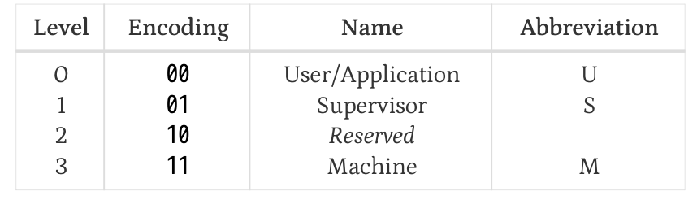

# Riscv boot squence
## Stage 1
Q1. riscv cpu 上电第一条指令执行在哪里？
Q2. riscv cpu 怎么扫描主板上的外设，怎么知道我的os存在哪里？

```
A1: 根据riscv的规范，riscv cpu上电复位后，pc指针被复位到一个默认值（这个默认值由CPU的制造商决定，不同riscv cpu 复位值可能不一样。虽然pc的值不一样，但复位后都指向一个ROM（这个ROM暂时不知道是在主板上还是在CPU内部））。这里区别于X86， X86 CPU 上电复位后PC都被复位成相同的值：CS: 0xF000 IP:0xFFF0。
A2：硬件上电后，先执行ROM中的程序，ROM中的程序负责硬件初始化，扫描外设，扫描存储介质，看看存储介质中有没有包含可以启动的OS。如果有，就把OS加载到内存中。然后再跳转过去。
```
```
一般情况下，risc-v cpu上电复位后，ip寄存器会指向0x1000,在qemu上（qemu-riscv64），cpu启动后，ip就复位成0x1000,指向的是qemu中内部模拟的rom中的程序，这个程序比较简单，就是简单跳转到0x80000000, 这里放着参数中指定的BIOS程序。
```

## riscv cpu 特权级

（数字越大，权限越高）
## riscv opensbi/rustsbi
SBI： Supervisor Binary Interface  
SBI 运行在M Mode

## Stage 2
Q1. opensbi是什么，为什么需要opensbi，为什么kernel不能直接运行在M-mode, X86上，kernel不就运行在ring 0吗？
```
A1: 
    简单来说，就是risc-v的cpu设计各不相同，这里指的是在ISA统一的情况下，各种外设的访问方式不一致。有点类似单片机，映像中不同的单片机型号A和B，对于同一个时钟的配置，可能访问的时钟寄存器不同（记得之前单片机开发，不同的单片机型号还要指定不同的SDK）。Opensbi架在cpu和os之间，负责屏蔽底层这些不同，向os提供统一的接口，比如时钟配置的话就提供统一的接口sbi_set_timer()。
    X86 CPU没这个问题，因为X86即使是各种各样的CPU，也会统一时钟访问的方式（即使用同一个外设地址）。
```

Q2. 划分这么多层级，每一层向下层进行系统调用，不都涉及上下文切换吗，这样不是要切换两个，性能是不是会差？
```
A2: 这种情况发生的比较少，大部分系统调用在内核就可以得到解决，不需要在往底层切换。
```

## riscv boot flow
```
先打住，各种riscv cpu的boot方式可能都不一样，当前先关注再qemu上的行为。具体的细节行为可以通过一生一芯来看。
```

## Stage 3
Q1: QEMU场景下，OS和RUSTSBI是打包到一起的吗，OS是RUSTSBI加载的吗？RUSTSBI怎么跳转到OS？

Q2: qemu-riscv64 模拟了一个怎么样的硬件，什么cpu，有哪些外设？