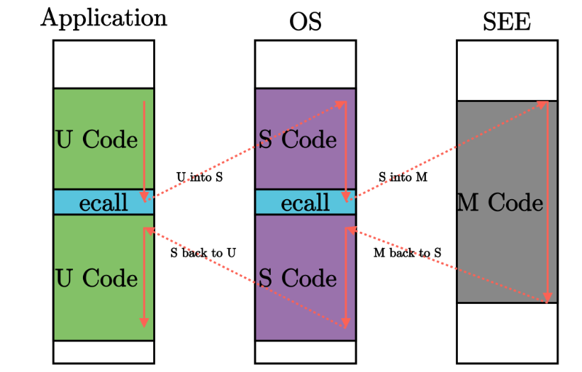
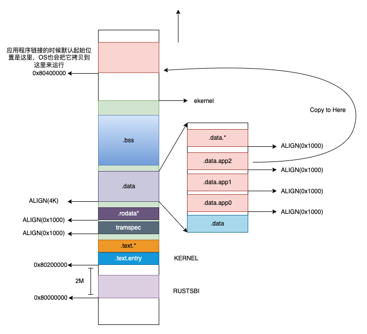

# 批处理系统（Batch System）
## 核心思想
将多个程序打包一起输入到计算机中。当一个程序执行完后，计算机自动加载并执行下一个程序。以此来提高计算机的利用率。

## 批处理监控程序（早期OS雏形）
监控多个程序自动加载，并执行下一个程序。

## 用户程序
区分监控程序和任务程序，就是OS和User Porgram

## 特权级
实现特权级的根本原因是应用程序的安全性不可充分信任。
```
早期的批处理出现在1950年代，这个时候应用程序比较少，还都是比较可以信任的，也就还没有特权级。但当时间发展，应用程序越来越多，应越来越不可信任，就需要特权级来限制了。
1964年，IBM System/360 首次引入保护模。
Intel 80286， x86架构首次引入保护模式，支持Ring0-3
（特权级，嘿嘿，如果特权阶级（OS）出问题又有谁来管理呢？）
```
### 特权级的取舍
```
RISC-V 架构中，只有 M 模式是必须实现的，剩下的特权级则可以根据跑在 CPU 上应用的实际需求进行调整：

简单的嵌入式应用只需要实现 M 模式；

带有一定保护能力的嵌入式系统需要实现 M/U 模式；

复杂的多任务系统则需要实现 M/S/U 模式。

到目前为止，(Hypervisor, H)模式的特权规范还没完全制定好。所以本书不会涉及。
```
## 异常 
与常规控制流 （顺序、循环、分支、函数调用）不同的 异常控制流 (ECF, Exception Control Flow) 被称为 异常（Exception）。即是从一个特权级切换到另一个特权级 
### 异常分类
1. Trap： 用于获取下层的服务，切换到下层，如ecall等
2. Fault: 上层执行出错，需要下层仲裁，切换到下层，如除0，非法访问等。

## ecall
ecall控制流切换


### riscv ecall
```
Q1. ecall从U跳转到S，和从S跳转到M，用的是同一个中断向量表吗？

A1. riscv使用统一异常入口的形式来处理异常，就是说所有的异常处理程序共用同一个异常程序入口，控制寄存器stvec指向这个程序的入口。scause存储具体的异常原因（类似异常号）。需要注意的是，S mode 使用stvec寄存器存储入口，M mode 使用 mtvec寄存器存储入口。
```
```
ecall 涉及的寄存器（硬件直接修改）：
    scause：记录异常或者中断的原因
    sepc: 处理完毕中断异常之后需要返回的PC值
    stval： 触发异常的指令本身，比如执行0xffff（非法指令）指令时，存这条非法指令
    stvec: 异常处理程序的起始地址
    sstatus： 记录一些比较重要的状态，比如是否允许中断异常嵌套

注：ecall执行后，pc的值会被替换成stvec的值，原来的pc值被覆盖，但是原来的pc值保存在了sepc中。
```

## 初始内存布局
Q1：内核是被完全加载到内存中了吗，RUSTSBI怎么知道内核有多大的？会不会存在边运行，边加载的场景？
Q2: 怎么把内核程序和用户程序分开？
Q3：内核从哪里加载用户程序？

A1：当前针对qemu-riscv64 -machine virt 平台，加载逻辑大概是下面这个样子：
    看qemu里面的代码，对于riscv virt平台，如果参数里面指定了firmware，就先加载firmware（从0x80000000开始加载，这个值也是virt平台DRAM开始的位置），
    加载完firmware之后，开始加载kernel，kernel的加载位置取决于加载完fireware的end_addr，64位平台下，拿end_addr 2M对齐。所以如果firmware小于2M，
    kernel就从0x80200000开始，（那真实的硬件又是什么样的呢？）。qemu下，firmware和kernel都是qemu加载的，firmware执行完后跳转到kernel。

A2: 在当前ch2中，用户程序和内核没有完全区分开，用户程序和内核链接到一起，用户程序链接到内核的.data段中


A3: 参考A2

## 整体流程
### 内核初始化
```
void main()
{
    clean_bss();
    trap_init(); /*初始化stvec寄存器的值*/
    loader_init();  /*加载app信息，内核通过访问link_app.S中定义的_app_num, app_0_start等符号来获得用户程序位置*/
    run_next_app(); /*拷贝并进行跳转*/
}
```
### 用户程序加载
```C

__attribute__((aligned(4096))) char user_stack[USER_STACK_SIZE]; //用户栈空间目前开辟在内核的数据段（之后肯定要改，不然会用户态写穿栈，会影响内核）
__attribute__((aligned(4096))) char trap_page[TRAP_PAGE_SIZE];

int run_next_app()
{
    struct trapframe *trapframe = (struct trapframe *)trap_page;
	app_cur++;
	app_info_ptr++;
	if (app_cur >= app_num) {
		return -1;
	}
	infof("load and run app %d", app_cur);
	uint64 length = load_app(app_info_ptr); //把程序mcmcpy到0x80400000
	debugf("bin range = [%p, %p)", *app_info_ptr, *app_info_ptr + length);
	memset(trapframe, 0, 4096);
	trapframe->epc = BASE_ADDRESS; //用户程序开始的地方
	trapframe->sp = (uint64)user_stack + USER_STACK_SIZE; //用户栈栈底
	usertrapret(trapframe, (uint64)boot_stack_top); //boot_stack_top是内核栈底
	return 0;
}

void usertrapret(struct trapframe *trapframe, uint64 kstack)
{
	trapframe->kernel_satp = r_satp(); // kernel page table， satp寄存器存放内核页表的页表基址（ch2 应该用不到）
	trapframe->kernel_sp = kstack + PGSIZE; // process's kernel stack，为啥要往上加一个PGSIZE？要做PGSIZE对齐，不应该减掉一个PGSIZE吗？
	trapframe->kernel_trap = (uint64)usertrap;
	trapframe->kernel_hartid = r_tp(); // hartid for cpuid()

	w_sepc(trapframe->epc);  //设置异常返回地址寄存器，异常返回时，会将epc的值同步成这个值
	// set up the registers that trampoline.S's sret will use
	// to get to user space.

	// set S Previous Privilege mode to User.
	uint64 x = r_sstatus();
	x &= ~SSTATUS_SPP; // clear SPP to 0 for user mode
	x |= SSTATUS_SPIE; // enable interrupts in user mode
	w_sstatus(x);

	// tell trampoline.S the user page table to switch to.
	// uint64 satp = MAKE_SATP(p->pagetable);
	userret((uint64)trapframe); //异常返回，进入用户态
}

```

Q1: 奇怪，内核栈的栈顶值不保存吗？程序退出后，内核的现场不是没了吗？（或者说内核需要保留栈上下文吗，是不是只要确保每次异常进来，只要有栈执行就可以了，具体的数据通过全局变量保存？？？）
A1: 当前ch2中，从内核态返回用户态，不管是从什么调用返回，都设置了同样的kernel_sp, 也就是说每次进入内核，kernel_sp的值都是相同的，但是每次进来的参数不同，也就形成kernel每次不同的行为

Q2: 关注两次sret有什么不一样，分别是os启动后第一次执行sret和后续异常处理结束后执行sret
A2：好像没啥不一样的
