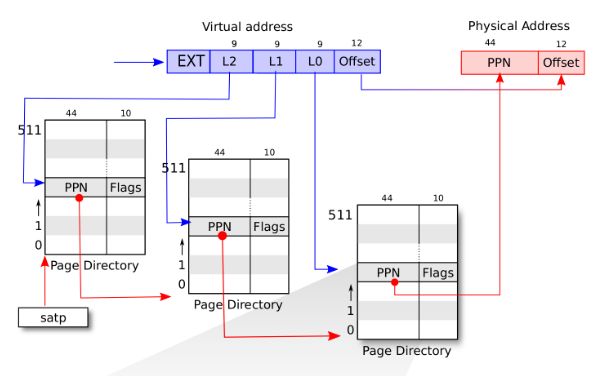
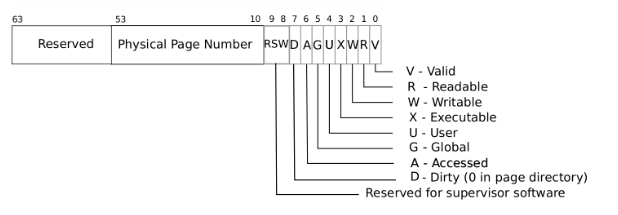
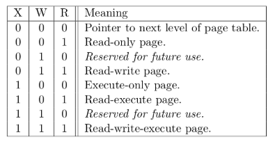
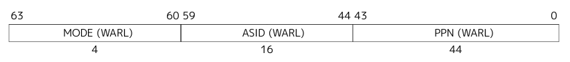

# 地址空间

## 当前系统的缺点
当前系统采用的是直接访问物理内存的方式来访存，每个进程划分了固定的内存空间，这样有如下缺点：
1. 编译麻烦，每个进程在编译时就需要知道自己之后要被加载到哪里运行，对于大量软件（分布开发），根本不可能，我怎么知道这块内存有没有人用。
2. 不安全，任意的进程都可以访问所有的物理地址空间，一个进程可以随意修改其他物理空间的值，甚至可以修改操作系统的值
3. 内存利用率低，每个进程划分了固定的空间，即使这个进程退出了，其他进程也不能加载到这块内存运行

## 关注虚存切换的临界时间点、

Q1: 已经加载到内存里的sbi会受后续虚存的影响吗？

## 分段管理
优点：每个进程段的数量较少，管理结构开销小  
缺点：同一个进程不同段大小不一样，不同进程相同段的大小也不一样，os在为段分配并管理内存的时候，容易产生外碎片  
## 分页管理
将虚拟内存划分成多个页，物理内存也划分成多个页，一个虚拟内存页对应一个物理内存页
优点：物理内存按固定大小管理，没有外碎片，每个页4K，也比较小，内碎片也比较小
缺点：每个虚拟内存页到物理内存页的映射都需要存储，这个映射表开销比较大

## 多级页表机制
从逻辑上看，虚拟页号到物理页号的对应，就是一个key-value的查询问题。 
从实现上看，在页表查询这个上下文里面，他是一个软硬件（MMU）联合的查询问题。既要考虑软件的效率，也要考虑硬件的效率，还要考虑内存的占用。

### Step 1
线性表查询：即把整个vm地址按4K为一页的大小进行编码，然后把每一页对应的物理页号放到一个数组里。进行地址转换的时候，直接计算虚存所属的vm 页 id，直接从数组中找到对应的物理页号。  
优点： 线性表的优点很明显，性能高，实现简单  
缺点： 线性表缺点就是内存占用大，对于key比较离散稀疏的情况，内存利用率不高。

### Step 2
平衡二叉树： 利用平衡二叉树的方式，存储虚拟页号到物理页号的对应关系，   
优点：从软件层面来说，平衡树是综合较优的结构，内存占用少，查询效率高，从硬件层面看，基于指针实现的树，硬件自动遍历好像也可行。  
缺点：虚拟页到物理页的映射，发生的非常频繁，十分注重效率，注重到需要专用硬件MMU的参与，如果使用平衡二叉树来存，树的平衡的很难从硬件层面来优化这个查询流程。

### Step 2.1
非平衡二叉树：非平衡二叉树缺点就是容易退化成线性表，查询速率变得很低  

### Step 2.2
静态二叉树（完全二叉树，整体层级结构是静态的（就是如果存在全部数据，全部插入到树上，无论各个数据的先后顺序，最后形成的树是一样的），但依然动态构建（就是树上的节点仍然是动态分配的））：牺牲掉插入时的动态特性，用比较静态的特性来换取稳定性。比如完全二叉树。在树的构建时，就按照构建一颗完全二叉树的方式去构建。  
二叉树的缺点：  
1. 二叉，导致层级较高，地址变大时，遍历的层数变多
2. 二叉，树的度数是二，深度就是log2，这里是个取舍问题，度数增加，可以降低层数，但是每个节点的数据变多。需要综合计算

### Step 2.3 
字典树：静态多叉树，每一层的节点属于特定集合

### Step 3
多级页表：我理解这就是一个限制了层级，反推度数的静态多叉树。本质是不是对线性表的扩展，而是对树的限制。  
优点： 出于它的静态特性，对他的查找和插入非常稳定，硬件层面也好适配
缺点： 也由于他的静态特性，存储单个key-value时，需要用到更多节点，比如在三级页表中，只存一个对应项（一个vm page和一个phy page），也要存三级，至少三个节点。同时由于被压缩到了三级，每个节点消耗的内存也会变大。

## sv39 三级页表
sv39是riscv64 cpu下的一种虚存模式，即采用39位虚拟内存地址（代码中依变量地址依然是64位）， 56位物理地址线。  
39位虚拟内存被拆分成两部分：29位的虚拟页号和12位的页内偏移   
  

Q1: 三级页表，每做一次地址转换，都需要三次访存来确认最终的地址，这不会很慢吗？  
A1：是的，所以后续CPU都会有TLB，就是快表  

三级页表中，页表项结构如下：  

```
当V为0时，代表当前指针是一个空指针，无法走向下一级节点，即该页表项对应的虚拟地址范围是无效的

只有当V 为1 且 R/W/X 均为 0 时，表示是一个合法的页目录表项，其包含的指针会指向下一级的页表。

注意: 当V 为1 且 R/W/X 不全为 0 时，表示是一个合法的页表项，其包含了虚地址对应的物理页号。

值得注意的是，叶节点不一定是第三层的节点，也可以是第二层的节点，如果第二层的节点是一个页表项，即V为1且R/W/X不为0，那么他保存的PPN不在用来指向下一级页表page，而是直接表示物理PPN，不过PPN内的偏移变成了9位的L0和12位的offset
```


### satp (Supervisor address translation and protection register)
在riscv64中，这个寄存器用来开启和关闭虚存功能


PPN指向根页表项的物理PPN

### Step 1
内核页表初始化：  
#### Step 1.1
内核一开始怎么管理物理内存，他怎么知道内存有多大，哪些可以用来管理。
```C
void main()
{
    ...
    kinit();
    kvm_init();
    ...
}

void kinit()
{
	freerange(ekernel, (void *)PHYSTOP);
}

void freerange(void *pa_start, void *pa_end)
{
	char *p;
	p = (char *)PGROUNDUP((uint64)pa_start);
	for (; p + PGSIZE <= (char *)pa_end; p += PGSIZE) /*遍历所有的phy page*/
		kfree(p);
}

//重点
//linklist 结构
/*
	struct linklist {
		struct linklist *next;
	};
*/
void kfree(void *pa)
{
	struct linklist *l;
	//recheck，检查pa是否pasize对齐，并且需要大于ekernel的子地址
	//小于PHYSTOP地址，注意PHYSTOP也是PGSIZE对齐的
	if (((uint64)pa % PGSIZE) != 0 || (char *)pa < ekernel ||
	    (uint64)pa >= PHYSTOP)
		panic("kfree");
	// Fill with junk to catch dangling refs.
	memset(pa, 1, PGSIZE);
	l = (struct linklist *)pa;
	l->next = kmem.freelist;
	kmem.freelist = l; //添加到kmem->list中
}

```
kvm_init
```C
void kvm_init(void)
{
	kernel_pagetable = kvmmake(); //kernel 页表
	w_satp(MAKE_SATP(kernel_pagetable));
	sfence_vma(); //刷新TLB
}

pagetable_t kvmmake(void)
{
	pagetable_t kpgtbl;
	kpgtbl = (pagetable_t)kalloc();
	memset(kpgtbl, 0, PGSIZE);
	// map kernel text executable and read-only.
	// 映射内核代码段，vm和pm相同，RX属性
	kvmmap(kpgtbl, KERNBASE, KERNBASE, (uint64)e_text - KERNBASE,
	       PTE_R | PTE_X);
	// map kernel data and the physical RAM we'll make use of.
	// 映射其他内存，包括数据段和kmem管理的内存
	kvmmap(kpgtbl, (uint64)e_text, (uint64)e_text, PHYSTOP - (uint64)e_text,
	       PTE_R | PTE_W);
	// 在内核中映射trampoline吗，还没太理解
	kvmmap(kpgtbl, TRAMPOLINE, (uint64)trampoline, PGSIZE, PTE_R | PTE_X);
	return kpgtbl;
}
//如果内核要映射所有的phy page，那内核的page table会很大啊！（大页？）

```

### Step 2
app加载
```C
/*ch4和ch3有些变化，ch4不再需要对app进行拷贝了，ch3则需要拷贝到对应内存位置，因为ch4的app采用统一的地址空间加虚存映射，不关心具体的物理地址了*/
/*关注text，data, stack，heap对应的物理内存及其的虚存映射*/
int run_all_app()
{
	for (int i = 0; i < app_num; ++i) {
		struct proc *p = allocproc();
		tracef("load app %d", i);
		bin_loader(app_info_ptr[i], app_info_ptr[i + 1], p);
		p->state = RUNNABLE;
	}
	return 0;
}

/*重点*/
pagetable_t bin_loader(uint64 start, uint64 end, struct proc *p)
{
	pagetable_t pg = uvmcreate(); //创建一个page table，一级页表

    //这里开始映射trapframe的虚存
    //TRAPFRAME 虚存地址
    // #define MAXVA (1L << (9 + 9 + 9 + 12 - 1))

    // // map the trampoline page to the highest address,
    // // in both user and kernel space.
    // #define USER_TOP (MAXVA)
    // #define TRAMPOLINE (USER_TOP - PGSIZE)
    // #define TRAPFRAME (TRAMPOLINE - PGSIZE)
    // TRAPFRAME为什么在User space也需要映射？

	if (mappages(pg, TRAPFRAME, PGSIZE, (uint64)p->trapframe,
		     PTE_R | PTE_W) < 0) {
		panic("mappages fail");
	}
	if (!PGALIGNED(start)) {
		panic("user program not aligned, start = %p", start);
	}
	if (!PGALIGNED(end)) {
		// Fix in ch5
		warnf("Some kernel data maybe mapped to user, start = %p, end = %p",
		      start, end);
	}
    //end address 向上取整
	end = PGROUNDUP(end);
    //需要映射的bin的长度
	uint64 length = end - start;
    //将这块物理内存映射到BASE_ADDRESS开始的虚存中
	if (mappages(pg, BASE_ADDRESS, length, start,
		     PTE_U | PTE_R | PTE_W | PTE_X) != 0) {
		panic("mappages fail");
	}
	p->pagetable = pg;
    //计算user space stack 虚存开始位置
	uint64 ustack_bottom_vaddr = BASE_ADDRESS + length + PAGE_SIZE;
	if (USTACK_SIZE != PAGE_SIZE) {
		// Fix in ch5
		panic("Unsupported");
	}
    //映射user space stack，长度是USTACK_SIZE = PAGE_SIZE
	mappages(pg, ustack_bottom_vaddr, USTACK_SIZE, (uint64)kalloc(),
		 PTE_U | PTE_R | PTE_W | PTE_X);
    

	p->ustack = ustack_bottom_vaddr;
	p->trapframe->epc = BASE_ADDRESS;
	p->trapframe->sp = p->ustack + USTACK_SIZE; //指向栈底
	p->max_page = PGROUNDUP(p->ustack + USTACK_SIZE - 1) / PAGE_SIZE;
	p->program_brk = p->ustack + USTACK_SIZE;
    p->heap_bottom = p->ustack + USTACK_SIZE;
	return pg;
}

```

### Step 3 exercise
#### Step 3.1
内核态和用户态传参
```C
//sys_write() 分析
//va 是 user space的虚存，且需明确是哪个进程的虚存（curr_proc指针！）
uint64 sys_write(int fd, uint64 va, uint len)
{
	debugf("sys_write fd = %d va = %x, len = %d", fd, va, len);
	if (fd != STDOUT)
		return -1;
	struct proc *p = curr_proc();
	char str[MAX_STR_LEN];
	int size = copyinstr(p->pagetable, str, va, MIN(len, MAX_STR_LEN));
	debugf("size = %d", size);
	for (int i = 0; i < size; ++i) {
		console_putchar(str[i]);
	}
	return size;
}

//重点是这个copyinstr
//关注下va跨页，pa跨页的情况
int copyinstr(pagetable_t pagetable, char *dst, uint64 srcva, uint64 max)
{
	uint64 n, va0, pa0;
	int got_null = 0, len = 0;

	while (got_null == 0 && max > 0) { //判断有没有拷贝完
		va0 = PGROUNDDOWN(srcva); //srcva 向下取整，找到对应的pa page
		pa0 = walkaddr(pagetable, va0); //找到这个进程中这个va对应的pa
		if (pa0 == 0)
			return -1;
		n = PGSIZE - (srcva - va0); //n的结果是这个pg中从srcva开始到pg结束的数量
		if (n > max) //不跨页
			n = max;

		char *p = (char *)(pa0 + (srcva - va0)); //开始拷贝的pa地址
		while (n > 0) {
			if (*p == '\0') {
				*dst = '\0';
				got_null = 1;
				break;
			} else {
				*dst = *p;
			}
			--n;
			--max;
			p++;
			dst++;
			len++;
		}

		srcva = va0 + PGSIZE;
	}
	return len;
}

```

## 问答作业
```
1. 参照sv39
2.1 缺页相关的异常：  
	12: Instruction Page Fault  
	13: Load Page Fault  
	14: Store/AMO Page Fault  
2.2 相关寄存器的值  
	scause: 存储异常的原因
	stvec: S mode异常处理程序其实地址
	sepc: 触发异常的指令的地址
	/*
		区分ecall和page fault触发的异常，对于ecall，当前的指令不再需要执行，sret的时候，需要执行sepc指向的下一条指令
	*/
2.3 Lazy的好处
	1. 减少程序的加载时间，加快程序响应速度
	2. 并不是所有的text段都会被运行，减少内存占用

2.4 10G VM 需占用的页表项（非大页）
	10G / 512 
2.5 Lazy策略实现
	1. 内核维护进程合理的vm区域，包括如下区域
		1.1 text段对应的vm
		1.2 data段对应的vm
		1.3 stack段对应的vm
		1.4 heap段（通过mmap申请并映射，unmap删除映射）
	2. 发生page fault时候，先检查vm是否在进程已映射的vm区域，如果是，就alloc page，建立页表映射，如果不是，就报segment fault

2.6 pte上的v flag会被置0,标记为无效页

3.1 没明白，页表更换不就是修改satp寄存器吗？
3.2 可以通过pte中的u标记来控制用户态访问行为
3.3 减少页表切换次数，用户进程进入内核不用切换页表（比如ecall，中断，还有page fault，只有确切切换进程在切换页表）
	用户态到内核态的传参会容易些，内核可以直接访问用户态传来的vm指针
3.4 双页表就是异常进入和异常退出前切换页表，单页表的话，进行schedule才切换页表

```
