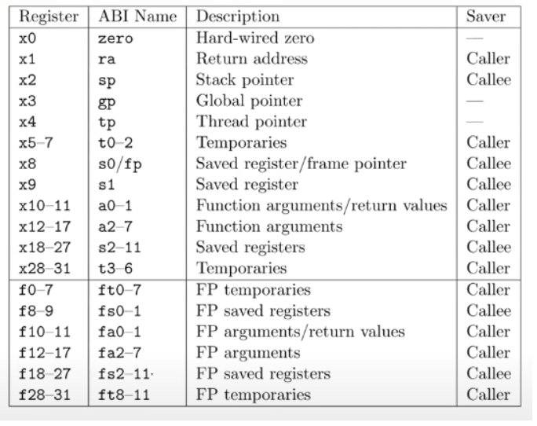

# RISCV 指令
## RISCV 寄存器

## RISCV（RV64I） 基本指令
RV64I是rsicv规定的64位机器的基础指令集，与之对应的由RV32I

## 指令分类
1. 算术和逻辑指令 （数据在寄存器中）
    1. 算术指令
    2. 逻辑指令
    3. 比较指令
    4. 移位指令
2. 数据传输指令
    1. 加载指令
    2. 存储指令
3. 控制了指令
    1. 跳转指令
    2. 分支指令
4. 立即数操作指令（数据就在指令里）
5. 系统指令 （ecall）
6. 伪指令

## 指令特点
1. 算术指令不直接操作内存，要加减内存中的数，要先进行load，load到寄存器中，进行加减（指令的操作数基本都是寄存器）

